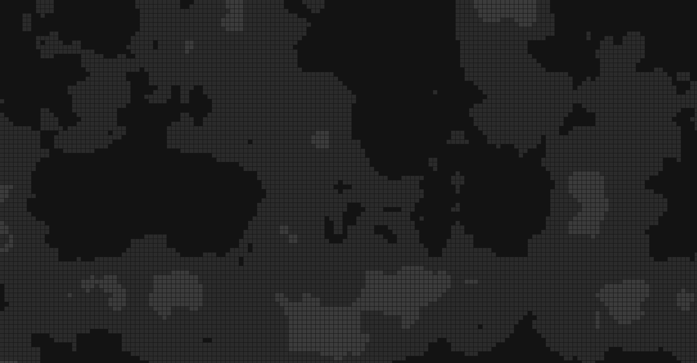

# backgroundgen
### generate a background pattern of square valleys with noise
https://neaflow.github.io/backgroundgen/

I'll make it more interesting later but it's just squares with these hard coded colours now
